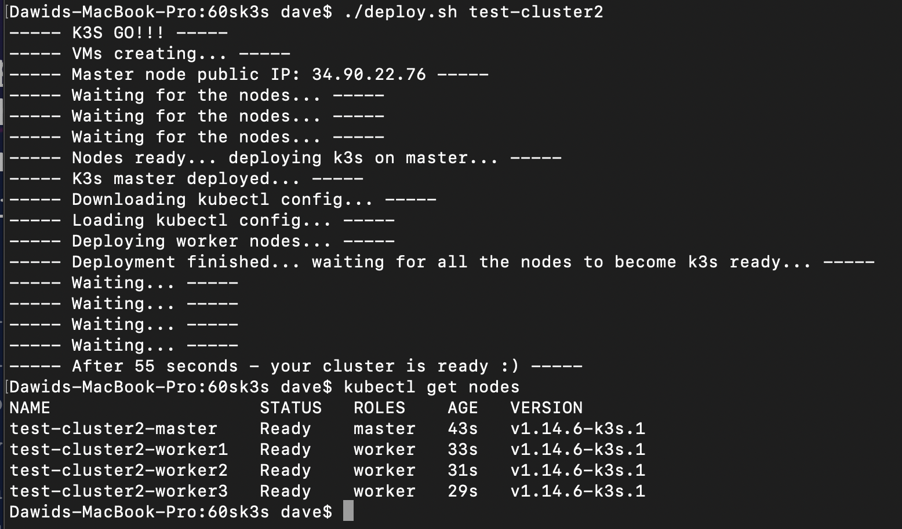

# 60sk3s
Under 60 seconds Kubernetes deployer

---

## WORK IN PROGRESS...

## Bash script for deploying 4 node (1 master + 3 workers) Kuberentes cluster (k3s) on Google Cloud. It creates VMs, then downloads and installs k3s on all nodes (making sure that workers join the master), and downloads kubectl config (and optionally directly loads it in your system).

It requires gcloud to be installed and configured and prefferably have default zone and project set up. If You don't have them set up you can do it by executing:

`gcloud config set compute/region europe-west4-a`

`gcloud config set core/project my-project`

another thing is to have ssh key loaded as metadata for project - in that case it will be added to any VM deployed in that project by default:

[How to add global ssh key](https://cloud.google.com/compute/docs/instances/adding-removing-ssh-keys#project-wide)

If You for some reason don't want to do that You can add commented line in the script to gcloud command:

> #--metadata=ssh-keys="[USER_AS_IN_SSH_KEY]:[YOUR_SSH_KEY_HERE]" \

Just keep in mind that You need to put user before your ssh key. So if You cat your id_rsa.pub at the end there will be something like john@host so then your metadata parameter should look like:

> --metadata=ssh-keys="john:ssh-rsa AAAAB3Nz[...]ktk/HB3 john@host" \

You also need to put the same user into "user" variable at the begginig of the script

And last but not least - load_kube_config variable defines if You only want to download kubectl config onto your machine (false) or You want to download it and overwrite your existing kubectl config (true)
